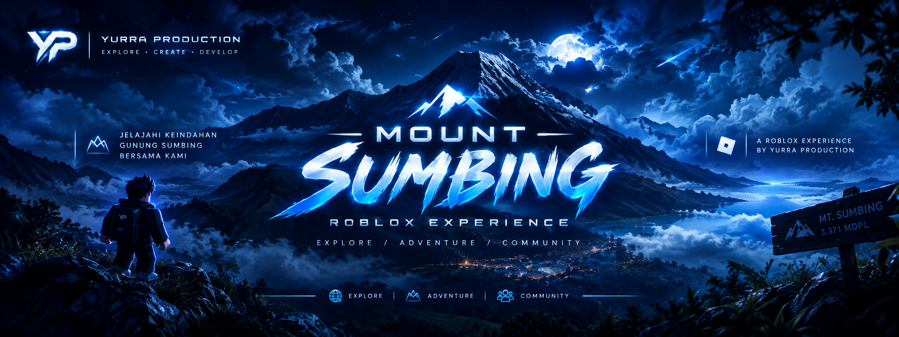

 

# 🏔️ Mount Sumbing

### Roblox Experience · Yurra Production

A community-driven Roblox experience focused on exploration, mountain environments, gameplay systems, and interactive community experiences.

---

## 🎮 About the Project

**Mount Sumbing** is a Roblox development project created as part of the Yurra Production ecosystem.

The project combines exploration, environment design, gameplay systems, and community activities into an interactive Roblox experience.

> Explore • Create • Develop.

---

## ✨ Features

- 🏔️ Mountain exploration
- 🌲 Environmental & map design
- 🎮 Interactive gameplay systems
- 🧭 Exploration experience
- 👥 Community-driven activities
- 🎟️ Events & player activities

---

## 🛠️ Development

| Category | Technology |
|---|---|
| Platform | Roblox |
| Engine | Roblox Studio |
| Programming | Luau |
| Development | Yurra Production |

---

## 🚧 Project Status

**In Development**

Features and systems are continuously developed and improved based on the direction of the project and community activities.

---

## 🌐 Yurra Production

Mount Sumbing is developed as part of **Yurra Production**, an independent developer and creative project brand focused on:

- Web Development
- Roblox Development
- Digital Projects
- Community Projects

---

## 🔗 Links

🌐 **Website:** https://imyurra.com

📸 **Instagram:** https://instagram.com/yurra.production

💻 **GitHub:** https://github.com/imyurra-web

---

### YURRA PRODUCTION

**Explore • Create • Develop. 🚀**
